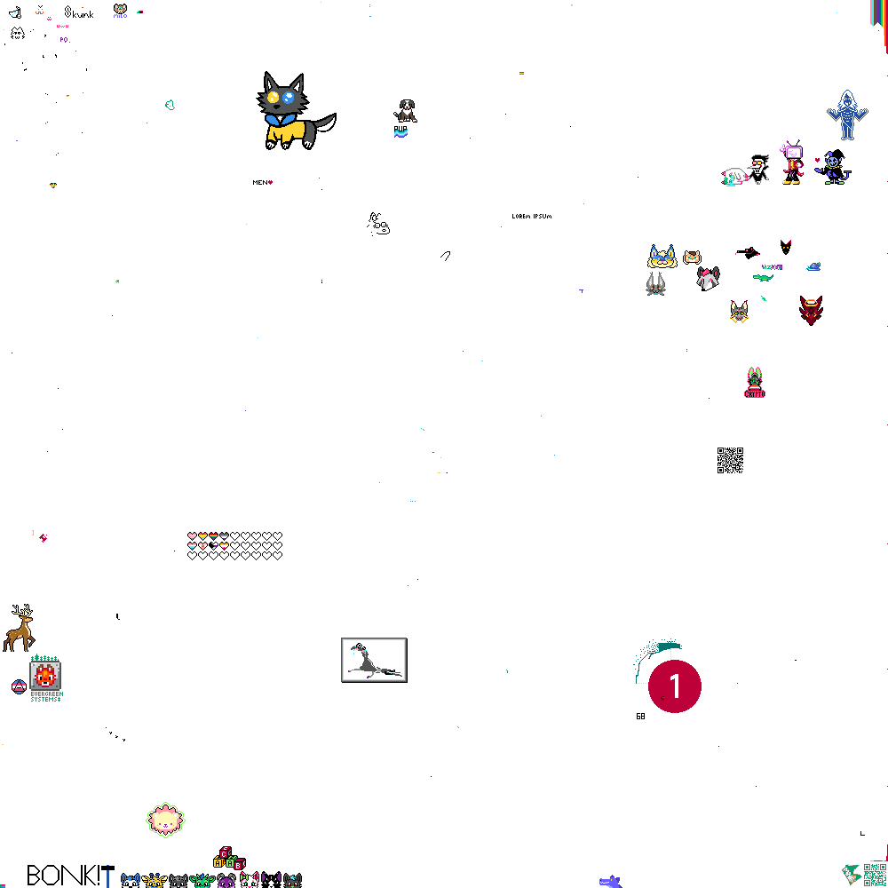

# MNFursPlace Timelapse Generator
This project is NOT affiliated with [MNFurs](https://mnfurs.org) or [MNFursPlace](https://mnfursplace.laravel.cloud/).

Generates a timelapse of https://mnfursplace.laravel.cloud/

## Installation

Install binaries (imagemagick, gifsicle, node):
```sh
apt-get install nodejs npm imagemagick-7.q16 gifsicle
```

Install node modules:
```sh
npm i
```

## Running
Run `./build.sh` and use the output file `output/final.gif` when the program finishes.

